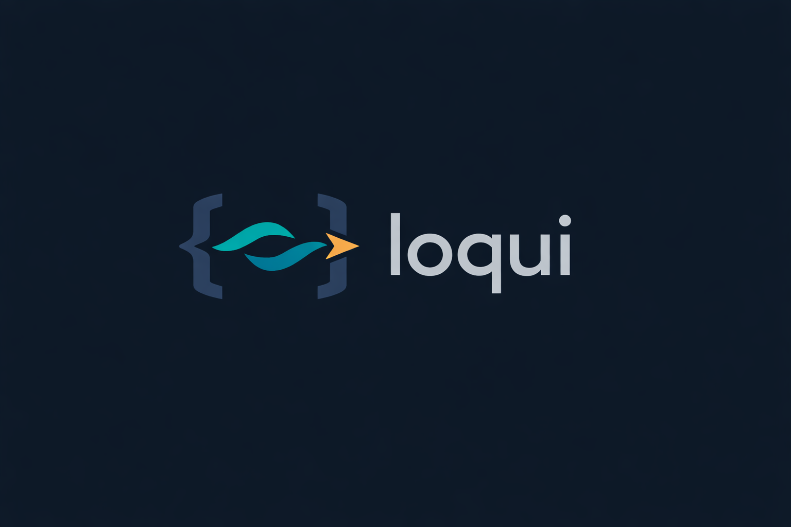

<p align="center">
  
</p>

<p align="center">
  <a href="https://www.npmjs.com/package/@mihairo/loqui"></a>
  <a href="https://github.com/mihai-ro/loquiai/actions/workflows/ci.yml"></a>
  <a href="https://github.com/mihai-ro/loquiai/blob/main/LICENSE"></a>
  <a href="https://www.npmjs.com/package/@mihairo/loqui"></a>
</p>

<p align="center">
  i18n translation engine powered by LLMs. Feed it a JSON file, get back translated JSON.<br/>
  No accounts, no dashboards, no lock-in.
</p>

```sh
npx @mihairo/loqui --input en.json --from en --to fr,de,es --output ./i18n/{locale}.json
```

---

## Features

- **Three LLM engines** — Gemini, OpenAI, Anthropic (bring your own API key)
- **Any model** — not locked to a specific version; pass any model string
- **Incremental translation** — only re-translate keys that changed since the last run (recommended)
- **Placeholder protection** — `{{mustache}}`, `${template}`, `{icu}`, ICU plural/select blocks, HTML tags, and custom patterns are never mutated
- **Custom prompts** — override system/user prompt templates with your own
- **Programmatic API** — `import { translate } from '@mihairo/loqui'`
- **CLI** — pipe-friendly, stdin/stdout support
- **Zero runtime dependencies** — only the TypeScript compiler for dev

---

## Installation

```sh
npm install @mihairo/loqui
# or
npm install -g @mihairo/loqui   # for the CLI globally
```

Requires **Node.js ≥ 22**.

---

## Quick start

**1. Create a config file interactively:**

```sh
npx @mihairo/loqui init
```

This walks you through choosing an engine, model, source locale, and target locales, then writes `.loqui.json` to your project root.

**2. Set your API key:**

```sh
export GEMINI_API_KEY=your-key-here
# or OPENAI_API_KEY / ANTHROPIC_API_KEY
```

**3. Translate:**

```sh
loqui --input en.json --output ./i18n/{locale}.json --incremental
```

---

## Configuration

All fields are optional. CLI flags always override the config file.

| Field                 | Type                                | Default            | Description                          |
| --------------------- | ----------------------------------- | ------------------ | ------------------------------------ |
| `engine`              | `gemini` \| `openai` \| `anthropic` | `gemini`           | LLM provider                         |
| `model`               | string                              | `gemini-2.5-flash` | Model name (any string)              |
| `from`                | string                              | —                  | Source locale (e.g. `en`)            |
| `to`                  | string[]                            | —                  | Target locales (e.g. `["fr","de"]`)  |
| `temperature`         | 0–2                                 | `0.1`              | Sampling temperature                 |
| `topP`                | 0–1                                 | `1`                | Nucleus sampling                     |
| `concurrency`         | 1–32                                | `8`                | Parallel API requests                |
| `splitToken`          | 500–32000                           | `4000`             | Max tokens per chunk                 |
| `context`             | string                              | —                  | Domain context injected into prompts |
| `prompts`             | `{ system?, user? }`                | —                  | Custom prompt templates              |
| `placeholderPatterns` | string[]                            | —                  | Extra regex patterns to protect      |

Config file is auto-discovered as `.loqui.json` in the current directory.

---

## CLI

```
loqui init                    Interactive setup — creates .loqui.json in the current directory

loqui [input] [options]

[input] — one of:
  --input <file>         read from a JSON file
  --input '<json>'       pass a JSON string inline
  first positional arg   loqui en.json --from en --to fr
  stdin                  cat en.json | loqui --from en --to fr

Options:
  --config <path>        Config file or directory (default: .loqui.json in cwd)
  --from <locale>        Source locale — overrides config.from
  --to <locale,...>      Target locale(s), comma-separated — overrides config.to
  --engine <name>        Engine: gemini | openai | anthropic — overrides config.engine
  --model <name>         Model name — overrides config.model
  --context <text>       Domain context injected into prompts — overrides config.context
  --output <path>        Output path. Use {locale} token: ./i18n/{locale}.json
                         Or a plain directory: writes {dir}/{locale}.json
  --namespace <name>     Namespace label injected into translation prompts
  --incremental          Only translate new/changed keys (uses a hash sidecar)
  --hash-file <path>     Hash sidecar path (implies --incremental)
  --dry-run              Preview without calling the API or writing files
  --force                Re-translate all keys regardless of existing translations
```

### Examples

```sh
# Translate a file, write per-locale files
loqui --input src/i18n/en.json --from en --to fr,de --output src/i18n/{locale}.json

# Pipe JSON through stdin, get JSON on stdout
cat en.json | loqui --from en --to ja

# Inline JSON as a positional arg
loqui '{"hello":"Hello"}' --from en --to fr

# Incremental — only re-translate changed keys
loqui --input en.json --from en --to fr,de --output ./i18n/{locale}.json --incremental

# Dry run — preview without any API calls or file writes
loqui --input en.json --from en --to fr --dry-run

# Use a different engine and model
loqui --input en.json --from en --to fr --engine anthropic --model claude-opus-4-6
```

---

## Programmatic API

```typescript
import { translate } from "@mihairo/loqui";

const result = await translate({
  input: "./en.json", // file path or raw JSON string
  from: "en",
  to: ["de", "es", "fr", "pt"],
  output: "./i18n/{locale}.json",
});

// result: { de: '{"hello":"Hallo"}', fr: '{"hello":"Bonjour"}', ... }
```

### `TranslateOptions`

```typescript
interface TranslateOptions {
  input: string; // file path or raw JSON string
  from?: string; // source locale
  to?: string | string[]; // target locale(s)
  output?: string | Record<string, string>; // {locale} template, dir, or locale→path map
  namespace?: string; // label injected into prompts
  incremental?: boolean; // hash-based change detection
  hashFile?: string; // custom hash sidecar path
  force?: boolean; // re-translate all keys
  dryRun?: boolean; // no API calls or writes
  engine?: EngineAdapter; // custom engine instance
  config?: Partial<LoquiConfig>; // inline config overrides
  configPath?: string; // path to config file or directory
}
```

### Return value

`translate()` returns `Promise<Record<string, string>>` — a map from locale to serialised JSON string.

If `output` is specified, files are written to disk and the same map is still returned.

---

## Batch workflow

Translate multiple namespaces with a simple script:

```typescript
import { translate } from "@mihairo/loqui";
import { readdirSync } from "fs";
import { join } from "path";

const I18N_DIR = "src/assets/i18n";
const FROM = "en";
const TO = ["fr", "de", "es"];

const namespaces = readdirSync(I18N_DIR, { withFileTypes: true })
  .filter((d) => d.isDirectory())
  .map((d) => d.name);

for (const ns of namespaces) {
  await translate({
    input: join(I18N_DIR, ns, `${FROM}.json`),
    from: FROM,
    to: TO,
    output: join(I18N_DIR, ns, "{locale}.json"),
    namespace: ns,
    incremental: true,
  });
}
```

---

## Placeholder protection

Tokens that must not be translated are automatically masked before the LLM call and restored afterward.

| Pattern             | Example                                         |
| ------------------- | ----------------------------------------------- |
| Double mustache     | `{{userName}}`, `{{count}}`                     |
| Template literal    | `${firstName}`                                  |
| ICU plural/select   | `{count, plural, one {# item} other {# items}}` |
| Simple ICU variable | `{name}`                                        |
| HTML tags           | `<strong>`, `</p>`, `<br/>`                     |

### Custom patterns

Add extra patterns in your config:

```json
{
  "placeholderPatterns": ["%{variable}", "__VAR__"]
}
```

Patterns are regex strings. Custom patterns are applied before the built-ins.

---

## Incremental translation

When `--incremental` is set (or `incremental: true` in the API), loqui stores a hash of each source value next to the input file as `.{name}.loqui-hash.json`. On subsequent runs, only keys whose source text changed (or that are missing from the target) are sent to the LLM.

```sh
loqui --input en.json --from en --to fr,de --output ./i18n/{locale}.json --incremental
```

The hash file path can be customised:

```sh
loqui --input en.json --incremental --hash-file .cache/en.hash.json ...
```

---

## Custom prompts

Override the system or user prompt with your own template. Available variables:

| Variable            | Description                         |
| ------------------- | ----------------------------------- |
| `{{sourceLocale}}`  | Source locale code (e.g. `en`)      |
| `{{targetLocales}}` | Comma-separated target locales      |
| `{{namespace}}`     | Namespace label (if provided)       |
| `{{context}}`       | Domain context string (if provided) |
| `{{json}}`          | The JSON chunk to translate         |

```json
{
  "prompts": {
    "system": "You are a professional translator for a SaaS product. Translate from {{sourceLocale}} to {{targetLocales}}. Keep all placeholders intact.",
    "user": "Translate this JSON:\n\n{{json}}"
  }
}
```

---

## Custom engines

Pass any object implementing `EngineAdapter` via the `engine` option to bypass the built-in providers entirely:

```typescript
import {
  translate,
  EngineAdapter,
  TranslationChunk,
  TranslationResult,
} from "@mihairo/loqui";

const myEngine: EngineAdapter = {
  async translateChunk(
    chunk: TranslationChunk,
    targetLocales: string[],
    sourceLocale: string,
    namespace: string,
  ) {
    const result: Record<string, TranslationResult> = {};
    for (const locale of targetLocales) {
      // call your own LLM or translation service here
      result[locale] = {
        keys: {
          /* translated flat key/value pairs */
        },
      };
    }
    return result;
  },
};

await translate({ input: "en.json", from: "en", to: ["fr"], engine: myEngine });
```

Or extend `BaseEngine` to reuse the built-in prompt builder and JSON response parser:

```typescript
import { BaseEngine, LoquiConfig, TranslationChunk } from "@mihairo/loqui";

class MyEngine extends BaseEngine {
  constructor(config: LoquiConfig) {
    super(config);
  }

  async translateChunk(
    chunk: TranslationChunk,
    targetLocales: string[],
    sourceLocale: string,
    namespace: string,
  ) {
    const systemPrompt = this.buildSystemPrompt(
      targetLocales,
      sourceLocale,
      namespace,
    );
    const userPrompt = this.buildUserPrompt(chunk, targetLocales, sourceLocale);

    const raw = await callMyLLM(systemPrompt, userPrompt); // your implementation

    return this.parseResponse(raw, Object.keys(chunk.keys), targetLocales);
  }
}

await translate({
  input: "en.json",
  from: "en",
  to: ["fr"],
  engine: new MyEngine(config),
});
```

---

## Environment variables

| Variable               | Required for          |
| ---------------------- | --------------------- |
| `GEMINI_API_KEY`       | `engine: "gemini"`    |
| `OPENAI_API_KEY`       | `engine: "openai"`    |
| `ANTHROPIC_API_KEY`    | `engine: "anthropic"` |
| `ANTHROPIC_API_VERSION` | Override Anthropic API version (default: `2023-06-01`) |

---

## Troubleshooting

| Symptom | Cause | Fix |
|---------|-------|-----|
| `GEMINI_API_KEY environment variable is not set` | Missing env var | Export the correct key for your engine |
| `'from' (source locale) is required` | No `from` in options or config | Add `from` to `.loqui.json` or pass `--from` |
| Empty translation strings in output | LLM response missing keys | Try reducing `splitToken`, check model availability |
| `Engine returned invalid JSON` | LLM returned non-JSON | Try a more capable model, or add `context` to help the LLM |
| `429` rate limit errors | Too many concurrent requests | Reduce `concurrency` in config (default: 8) |
| Keys not re-translated after source changes | Hash file has stale values | Run with `--force` once to reset, or delete the `.loqui-hash.json` sidecar |
| `Failed to parse '.loqui.json'` | Syntax error in config | Validate the JSON at jsonlint.com or similar |

## Performance Tuning

### `splitToken` (default: 4000)

Controls how many source keys are bundled into a single LLM request. Higher = fewer requests (faster, cheaper) but risks hitting model context limits. Lower = safer for models with small context windows.

- **4000** — Recommended for Flash/GPT-4o-mini tier models
- **12000+** — Recommended for Pro/GPT-4o tier models

### `concurrency` (default: 8)

Number of simultaneous API requests. Higher = faster for large files but risks rate limits.

- Reduce to 3–4 if you see frequent 429s
- Free-tier API keys: use 1–2

### `--incremental`

Always use this flag for repeated runs. Skips unchanged keys entirely. On a 1000-key file where only 10 keys changed, you pay for 10 keys, not 1000.

---

## GitHub Actions

Integrate loqui into your CI pipeline to automatically translate i18n files on push.

### Example workflow

```yaml
name: Translate i18n

on:
  push:
    paths: ['src/i18n/en.json']

jobs:
  translate:
    runs-on: ubuntu-latest
    steps:
      - uses: actions/checkout@v4
      - uses: actions/setup-node@v4
        with:
          node-version: 20
          cache: 'npm'
      - run: npm ci
      - run: npx @mihairo/loqui --input src/i18n/en.json --from en --to fr,de,es --output src/i18n/{locale}.json --incremental
        env:
          GEMINI_API_KEY: ${{ secrets.GEMINI_API_KEY }}
      - uses: peter-evans/create-pull-request@v6
        with:
          title: 'chore: update i18n translations'
          commit-message: 'chore: update i18n translations'
          branch: i18n/update
```

### Create your own action

A standalone GitHub Action reference is available at [.github/actions/loqui/action.yml](.github/actions/loqui/action.yml) for use in other repositories.

---

## Contributing

See [CONTRIBUTING.md](CONTRIBUTING.md) for guidelines on setting up the project, running tests, and submitting pull requests. Please read the [Code of Conduct](CODE_OF_CONDUCT.md) before participating.

---

## License

Apache 2.0 — see [LICENSE](LICENSE) for details.
